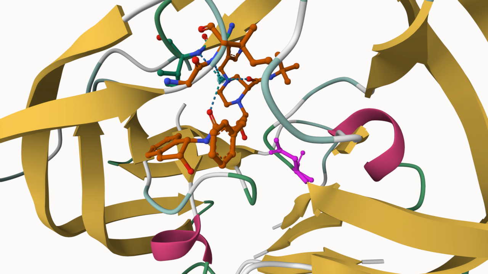
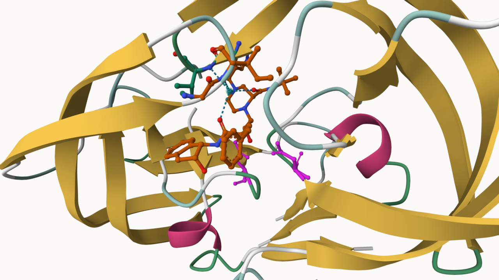
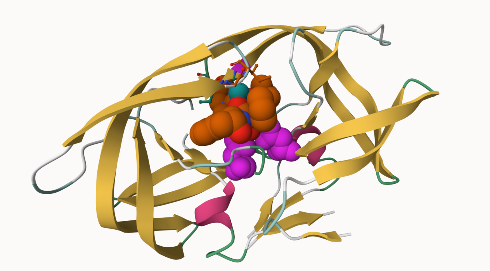

## **Introduction to the RCSB Protein Data Bank (PDB)**

### **PDB statistics**

Download CSV File

```{r}
# Loading pdb stats file onto R

pdb_data <- read.csv("pdb_stats.csv")
pdb_data

```

**Q1: What percentage of structures in the PDB are solved by X-Ray and Electron Microscopy?**

> **Answer Q1:** As shown below, **93.79%** of the structures in the PDB are solved by X-Ray and Electron Microscopy.

```{r}
# Count the structures solved by X-Ray
xray_total <- sum(pdb_data$X.ray)

# Count the structures solved by Electron Microscopy
em_total <- sum(pdb_data$EM)

# Count the total structures solved for in PDB dataset 
total_total <- sum(pdb_data$Total)

# Find percentage by adding X-Ray & EM then diving by total structures 
percent_combined <- ((xray_total + em_total) / total_total) * 100
percent_combined

```

**Q2: What proportion of structures in the PDB are protein?**

> **Answer Q2:** As shown with the calculations below, **97.91%** of the structures in the PDB are proteins; this inclues pure proteins (such as protein_only) and other combination of complexes that have *partial* proteins (such as protein_oligosaccharide, and protein_na).

```{r}
# Assign row names 
rownames(pdb_data) <- pdb_data$Molecular.Type

# Create a Vector for the total "Protein_ONLY" structures
protein_only <- pdb_data["Protein (only)", "Total"]

# Create a Vector for the total "Protein/Oligosaccharide" structures 
protein_oligosaccharide <- pdb_data["Protein/Oligosaccharide", "Total"]

# Create a Vector for the total "Protien_NA" structures
protein_na <- pdb_data["Protein/NA", "Total"]

#Calculate percentage of combined proteins using vectors created above
percent_protein <- (((protein_only + protein_oligosaccharide + protein_na) / total_total) * 100)
percent_protein

```

**Q3: Type HIV in the PDB website search box on the home page and determine how many HIV-1 protease structures are in the current PDB?**

> **Answer Q3:** There are **718** HIV-1 protease structures in the current PDB website / database. PDB Results: "This query matches 718 Structures".

## **Visualizing the HIV-1 protease structure**

Generate and Insert an image of the HIV-cartoon polymer, showing the inhibitor, ASP25, and water 308 

```{r}


```


### **The important role of water**

**Q4: Water molecules normally have 3 atoms. Why do we see just one atom per water molecule in this structure?**

> **Answer Q4:** In the structure provided by Molstar, we only see one atom used to represent each water molecules rather than its 3 atoms (2 Hydrogens and 1 Oxygen). This happens because the EM technique uses electron density to "stipple" the shade of electrons in the molecules configuration. In water, the singular electrons from each hydrogen are being towards oxygen due to oxygen's higher electronegativity. In other words, while oxygen portrays a dense cloud of atoms the hydrogen atom is not dense hence why the hydrogens are often missed in the stipple configuration of water created by EM.

**Q5: There is a critical “conserved” water molecule in the binding site. Can you identify this water molecule? What residue number does this water molecule have?**

> **Answer Q5:** Yes, there is a critical "conserved" water molecule in the binding site of 1HSG. The this conserved water molecule is found in between 2 oxygens of the 1HSG's ligand. Its residue number is HOH: 308.

**Q6: Generate and save a figure clearly showing the two distinct chains of HIV-protease along with the ligand. You might also consider showing the catalytic residues ASP 25 in each chain and the critical water (we recommend “Ball & Stick” for these side-chains). Add this figure to your Quarto document.**

> **Answer Q6:** Saved images provided below. The first image shows the two HIV protease chains, long with the ligand(orange), the two catalytic residues ASP25 (magenta, one per chain), and the critical water component(aqua-blue); all of these represented as ball and stick. The second image shows these same components but the ligand is shown with orange spacefill, both Asp25 are shows with pink(magenta) spacefill, and the conserved water is shown with blue spacefill. I prefer the second image as these globular structures are simpler to see and it is easier to spot the conserved water atom and its location in the binding site.

```{r}
# Ball and Stick Image 


# Spacefill Image

```

**Q7: \[Optional\]** As you have hopefully observed HIV protease is a homodimer (i.e. it is composed of two identical chains). With the aid of the graphic display can you identify secondary structure elements that are likely to only form in the dimer rather than the monomer?

> **Answer Q7:** SKIPPED

## **Introduction to Bio3D in R**

Since Bio3D was installed at the beginning of class, now its time to just call it out in R.

```{r}
# Call Out Bio3D
library(bio3d)
```

### **Reading PDB file data into R**

```{r}
# Load summary of contents in pdb object 
pdb <- read.pdb("1hsg")
pdb
```

**Q7: How many amino acid residues are there in this pdb object?**

> **Answer Q7:** There are a total of **198 amino acid residues** in this pdb object.

**Q8: Name one of the two non-protein residues?**

> **Answer Q8:** One of the two non-protein residues is **HOH** (water).

**Q9: How many protein chains are in this structure?**

> **Answer Q9:** There are **2 protein chains** in this structure.

Attributes:

```{r}
# Find the attibutes of he pdb file 

attributes(pdb)
```

Find atom attribute

```{r}
# Call out the atom attribute 
head(pdb$atom)
```

### **Predicting functional motions of a single structure**

```{r}
# Read PDB structure of Adenylate Kinase
adk <- read.pdb("6s36")
adk
```

Plot the flexibility predictions for adk structure 
```{r}
# Perform flexiblity prediction
m <- nma(adk)
plot(m)
```
## **Comparative structure analysis of Adenylate Kinase** 

### **Setup**

Install packages in the R console NOT your Rmd/Quarto file

**Q10: Which of the packages above is found only on BioConductor and not CRAN?** 

> **Answer Q10:** The **msa** package is found only on BioConductor and not on CRAN. *BiocManager::install("msa")* 

**Q11: Which of the above packages is not found on BioConductor or CRAN?**

> **Answer Q11:** The **bio3dview** package was not found on BioConductor or CRAN. *remotes::install_github("bioboot/bio3dview")*

**Q12: True or False? Functions from the pak package can be used to install packages from GitHub and BitBucket?**

> **Answer Q12:** **TRUE** because the pak package is used as a replacement for older installation methods such as those form GitHub and BitBucket. 

### **Search and retrieve ADK structures** 

```{r}
# identify related structures to our query Adenylate kinase
library(bio3d)
aa <- get.seq("1ake_A")
aa
```

**Q13: How many amino acids are in this sequence, i.e. how long is this sequence?** 

> **Answer Q13:** There are a total of **214 amino acids** in this sequence. 

Optional:

```{r}
# Blast or hmmer search 
#b <- blast.pdb(aa)
# Plot a summary of search results
#hits <- plot(b)
# List out some 'top hits'
#head(hits$pdb.id)
```

Required: 

```{r}
hits <- NULL
hits$pdb.id <- c('1AKE_A','6S36_A','6RZE_A','3HPR_A','1E4V_A','5EJE_A','1E4Y_A','3X2S_A','6HAP_A','6HAM_A','4K46_A','3GMT_A','4PZL_A')
```

```{r}
# Download releated PDB files
files <- get.pdb(hits$pdb.id, path="pdbs", split=TRUE, gzip=TRUE)
```

### **Align and superpose structures** 

```{r}
# Align releated PDBs
pdbs <- pdbaln(files, fit = TRUE, exefile="msa")
```

### **Annotate collected PDB structures**

```{r}
# Vector containing PDB database codes
ids <- basename.pdb(pdbs$id)

anno <- pdb.annotate(ids)
unique(anno$source)

# View anno
anno
```

### **Principal component analysis** 

```{r}
# Perform PCA
pc.xray <- pca(pdbs)
plot(pc.xray)

```

```{r}
# Calculate RMSD
rd <- rmsd(pdbs)

# Structure-based clustering
hc.rd <- hclust(dist(rd))
grps.rd <- cutree(hc.rd, k=3)

plot(pc.xray, 1:2, col="grey50", bg=grps.rd, pch=21, cex=1)
```

### **PCA visualization** 

```{r}
# Visualize first principal component
pc1 <- mktrj(pc.xray, pc=1, file="pc_1.pdb")
```

## **Normal mode analysis [optional]** 

```{r}
# NMA of all structures
modes <- nma(pdbs)

# Plot 
plot(modes, pdbs, col=grps.rd)
```

**Q14: What do you note about this plot? Are the black and colored lines similar or different? Where do you think they differ most and why?** 

> **Answer Q14:** This plot displays the replationship between the residue number (its position) and its corresponding fluctuation (degree of flexibility). The black and colored lines are similiar in the sense that the overall peak shapes are the same amongst them. In other words, the black and colored lines are similar in their peaks but they differ in size (magnitude). These differ the most between regions 120 - 160. Between this region we see a large difference in peak heights which suggests that the colored structures are mcuh more flexible and hints at their conformation being open or intermeditate. (Intermediate stages in binding is when a structure is in its most flexible state.)