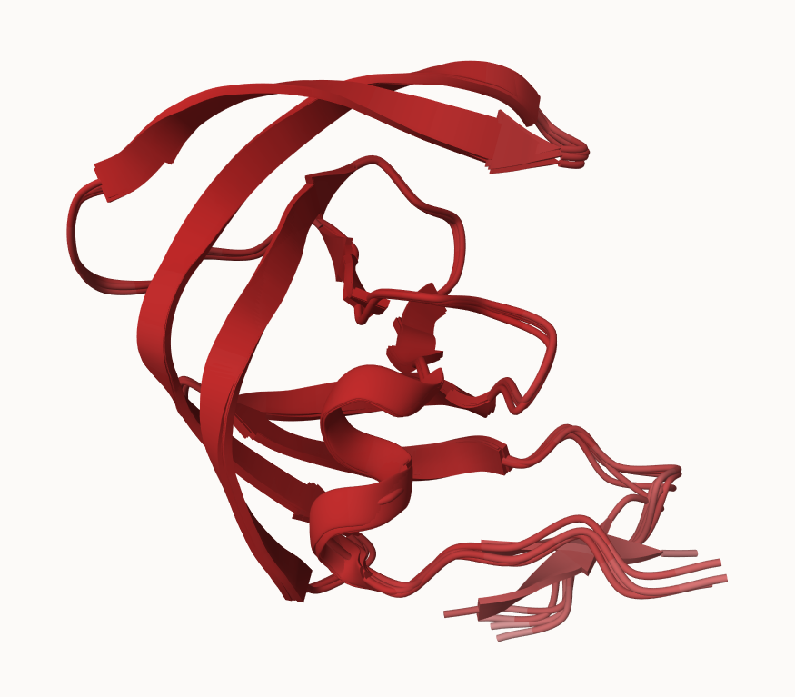
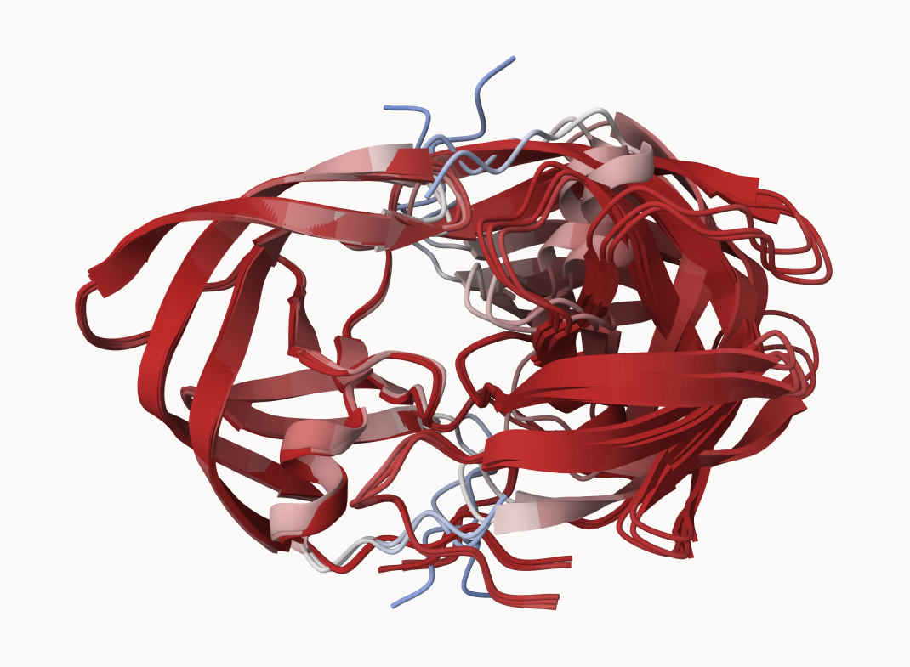
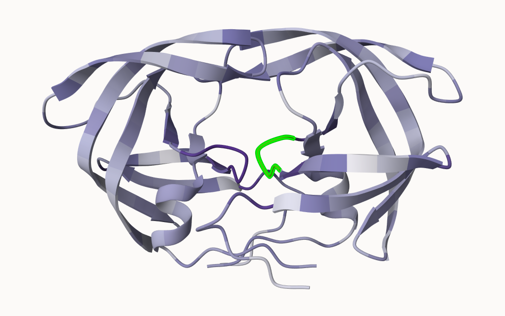

Sections 1-4 were discussed in Class

## **Section 5: The EBI AlphaFold database**

### **Querying the AlphaFold database**

Familiarize ourselves with AlphaFold DataBase

Start by loking for HIV-Protease structure in the AlphaFold Database by searching an HIV-PR sequence and examining its top hits.

> My Top Hit: "Gag-Pol polyprotein" from *Human immunodeficiency virus type 1 group M subtype B* with id *P04585*

## **Section 6: Generating your own structure predictions**

### **Getting Started with ColabFold**

Performed the HIV-Pr-Monomer input for my first Colab Notebook. The monomer version of this protein is unstable in reality but its dimerized conformation is the functional unit. We used the monomer version for the first run because it is easier to superimpose this single chain model on molstar.

Zip file automatically downloaded after this procedure.

## **Section 7: Interpreting Results**

### **Visualization of the models and their estimated reliability**

> Using Mol (molstar)

Below is the image generated for Figure 18

>  HIV-Pr-Monomer;

```{r}
# Figure 18: HivPr- Monomer  


```

## **Section 8: Custom analysis of resulting models**

Creating a vector for the extended zip file which contains our hivpr-dimer information. Read results for HIV-Pr-Dimer in R using the Bio3D package. 

```{r}
# Results dir name & Vector 
results_dir <- "hivprdimer_23119" 

```

Create Vector for all pdb files. There should be a total of 5 pdbs: 

```{r}
# File names for all PDB models
pdb_files <- list.files(path=results_dir,
                        pattern="*.pdb",
                        full.names = TRUE)

# Print our PDB file names
basename(pdb_files)
```
Use pdbaln() function to align the amino acid sequences so R knows which residue in Protein A corresponds to which residue in Protein B. 

```{r}
library(bio3d)

# Read all data from Models 
#  and superpose/fit coords
pdbs <- pdbaln(pdb_files, fit=TRUE, exefile="msa")
```

Viewing Model Sequences

> *All sequences should be the same*

```{r}
# pdb Sequences
pdbs
```

Use the rmsd() function to calculate the RMSD between all pairs models.

```{r}
# Calculate Root Mean Square Deviation (RMSD) for aligned protein structures
rd <- rmsd(pdbs, fit=T) 

# Use range function for max and min RMSD values 
range(rd)
```

Heatmap of RMSD matrix values

```{r}
library(pheatmap)

colnames(rd) <- paste0("m",1:5)
rownames(rd) <- paste0("m",1:5)
pheatmap(rd)
```

> Scale represents structural distance between models 1-5 shown as m1-m5. 

> *Note: models 1 and 2 are more similar to each other than they are to any other model. Models 4 and 5 are quite similar to each other and in turn more similar to model 3 than to models 1 and 2.*


Plot pLDDT values

```{r}
# Read a reference PDB structure
pdb <- read.pdb("1hsg")
```

Flexibility Profile Plot: 

> *Used to compare the stability and movement of specific regions across your five different protein models* 

```{r}
plotb3(pdbs$b[1,], typ="l", lwd=2, sse=pdb)
points(pdbs$b[2,], typ="l", col="red")
points(pdbs$b[3,], typ="l", col="blue")
points(pdbs$b[4,], typ="l", col="darkgreen")
points(pdbs$b[5,], typ="l", col="orange")
abline(v=100, col="gray")
```

Improve superposition model using core.find

```{r}
# Find most consistent "rigid core" 
core <- core.find(pdbs)
```

```{r}
# Basis for more suitable superpositions
core.inds <- print(core, vol=0.5)
```
Generate physical PDB files

```{r}
# These pdb structures accessible as "corefit_structures
xyz <- pdbfit(pdbs, core.inds, outpath="corefit_structures")
```

Generating **Figure 19** 

> This image only superimposes on one of the two chains because molstar does not allow for a perfect superimposition of both chains as the second structure is much more variable.

```{r}
# Figure 19; Superimposed HIV-Pr-Dimer

```
Examine the RMSF between positions of the structure

```{r}
rf <- rmsf(xyz)

plotb3(rf, sse=pdb)
abline(v=100, col="gray", ylab="RMSF")
```
> *Note: Here we see that the first chain is largely very similar across the different models. However, the second chain is much more variable - we saw this in Molstar previously* 

### **Predicted Alignment Error for domains** 

Read PAE files 

```{r}
library(jsonlite)

# Listing of all PAE JSON files
pae_files <- list.files(path=results_dir,
                        pattern=".*model.*\\.json",
                        full.names = TRUE)
```

> *Note: AlphaFold produces a useful inter-domain prediction for model 1 (and 2) but not for model 5 (or indeed models 3, 4, and 5)*

Read First and Fifth file
```{r}
# Call out first and 5th files as a vector and read attributes
pae1 <- read_json(pae_files[1],simplifyVector = TRUE)
pae5 <- read_json(pae_files[5],simplifyVector = TRUE)

attributes(pae1)
```


```{r}
# Per-residue pLDDT scores 
#  same as B-factor of PDB..
head(pae1$plddt) 
```

Maximum PAE values are useful for ranking models

```{r}
# Max PAE value for model 1
pae1$max_pae
```

```{r}
# Max PAE value for model 5
pae5$max_pae
```

> *Note: Model 5 is much worse than model 1. The lower the PAE score the better*

**Question: How about the other models, what are there max PAE scores?**

> **Answer:** Out of all five models, model 4 is the one wiht the highest PAE score being 29.57812. Their ranking from lowest to highest (best to worst) are as follows: M1 (max_PAE = 12.33594), M3 (max_PAE = 14.39062), M2 (max_PAE = 17.48438), M5 (max_PAE = 29.45312), and M4 (max_PAE = 29.57812)

```{r}
# Read Models 2-4
pae2 <- read_json(pae_files[2],simplifyVector = TRUE)
pae3 <- read_json(pae_files[3],simplifyVector = TRUE)
pae4 <- read_json(pae_files[4],simplifyVector = TRUE)

# Max PAE values for all models 
pae1$max_pae
pae2$max_pae
pae3$max_pae
pae4$max_pae
pae5$max_pae
```

Plot the N by N (where N is the number of residues) PAE scores with functions from the Bio3D package:

```{r}
# Generate PAE heatmap Model 1
plot.dmat(pae1$pae, 
          xlab="Residue Position (i)",
          ylab="Residue Position (j)")
```

```{r}
# Generate PAE heatmap Model 5

plot.dmat(pae5$pae, 
          xlab="Residue Position (i)",
          ylab="Residue Position (j)",
          grid.col = "black",
          zlim=c(0,30))
```

```{r}
# Generate PAE heatmap Model 1 with same z range as Model 5
plot.dmat(pae1$pae, 
          xlab="Residue Position (i)",
          ylab="Residue Position (j)",
          grid.col = "black",
          zlim=c(0,30))
```

### **Residue conservation from alignment file**

File Finding Mission 

```{r}
# Locate  specific alignment files generated by AlphaFold
aln_file <- list.files(path=results_dir,
                       pattern=".a3m$",
                        full.names = TRUE)
aln_file
```

Move Localized File into R

```{r}
# Read alignment file
aln <- read.fasta(aln_file[1], to.upper = TRUE)
```

**How many sequences are in this alignment** 

> There are **5397 sequences** being aligned 

```{r}
dim(aln$ali)
```

Score residue conservation 

```{r}
# Score residue conservation in alignment using conserv() function
sim <- conserv(aln)
```

Plot Conservation Scores 

```{r}
# Plot of Residue vs. Conservation Score
plotb3(sim[1:99], sse=trim.pdb(pdb, chain="A"),
       ylab="Conservation Score")
```

Cut off for 90& conservation to determine residues with high cutoff vlaues

```{r}
# Cut off value of 0.9 
con <- consensus(aln, cutoff = 0.9)
con$seq
```
Map this conservation score to the Occupancy column of a PDB file for viewing in molstar. 

```{r}
m1.pdb <- read.pdb(pdb_files[1])
occ <- vec2resno(c(sim[1:99], sim[1:99]), m1.pdb$atom$resno)
write.pdb(m1.pdb, o=occ, file="m1_conserv.pdb")
```

> ^ Acces this in molstar to generate fig.20

Image / Screenshot for Figure 20 shown Below 

```{r}
# Figure 20; Colored by Sequence Conservation 
# DTGA motif of one chain is highlighted in green

```
